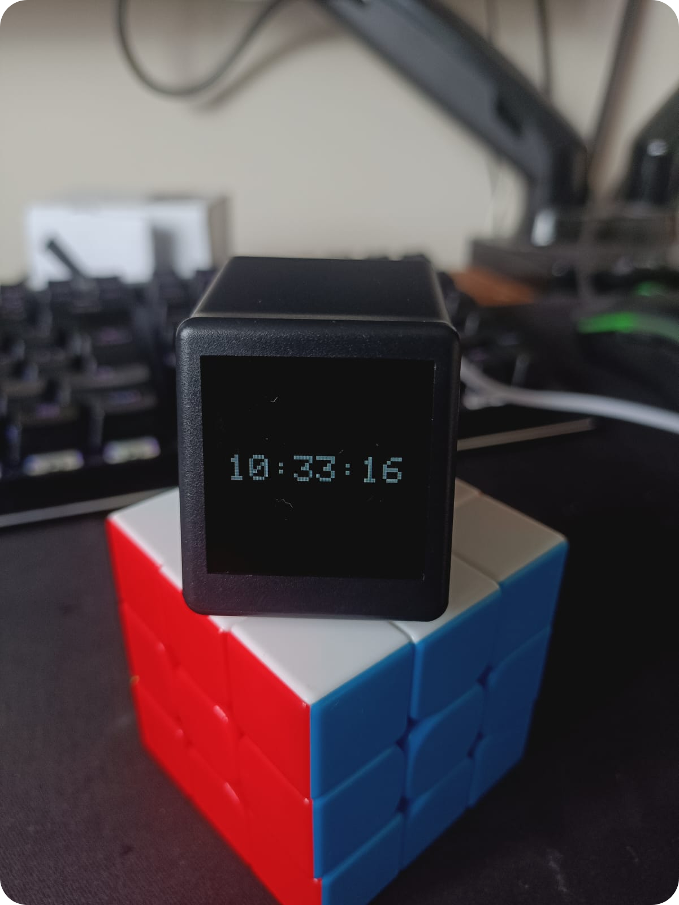
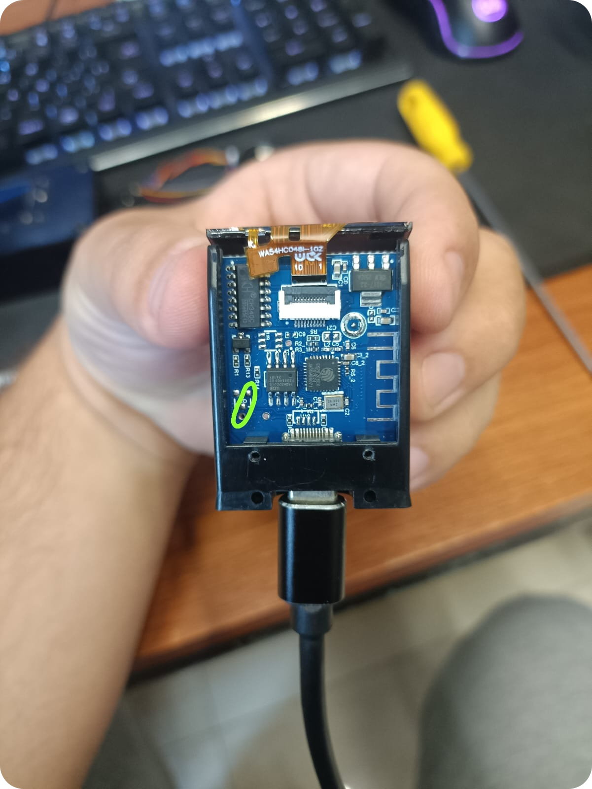
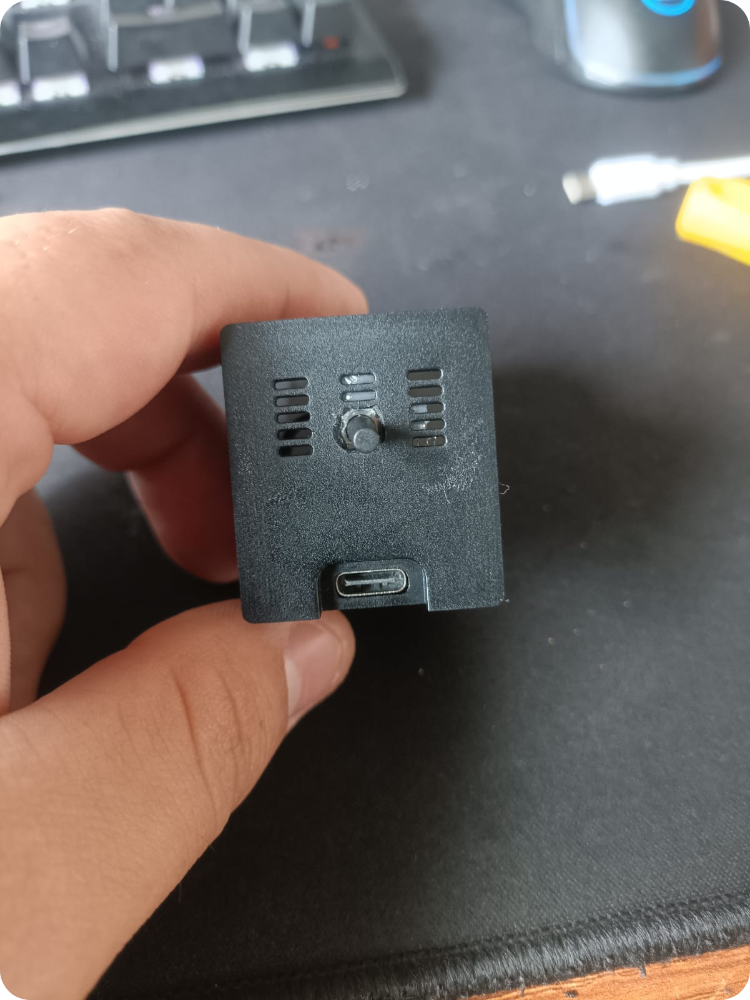
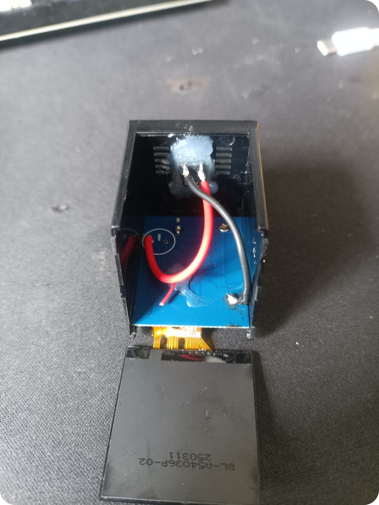
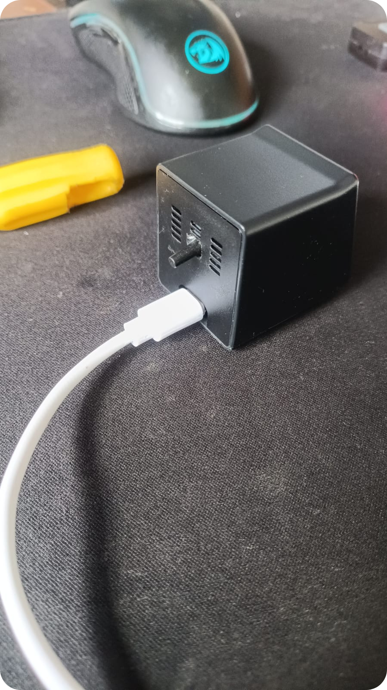
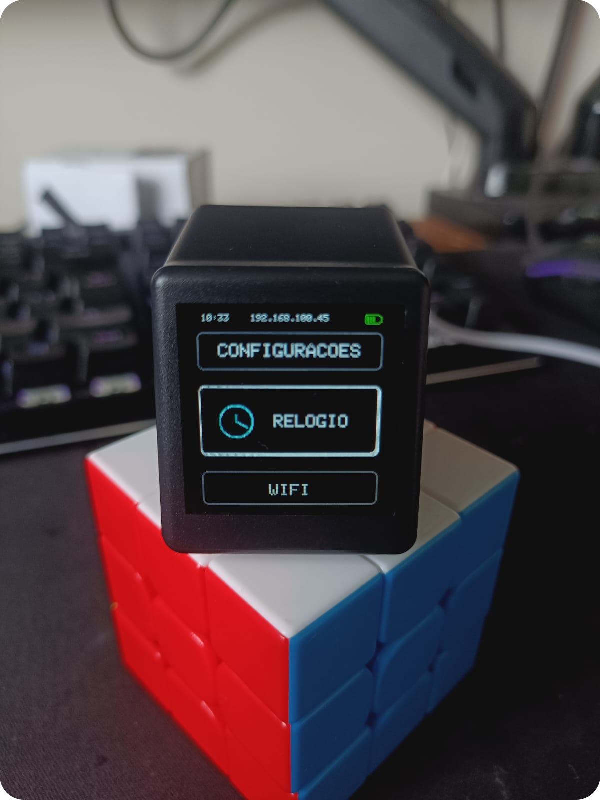
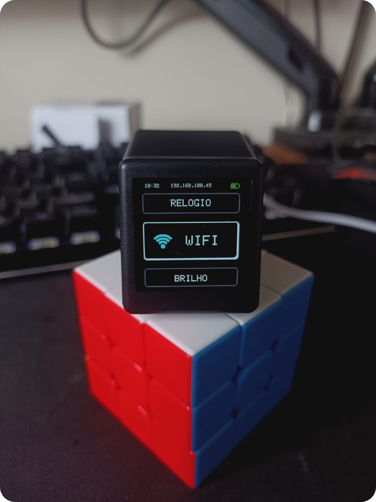
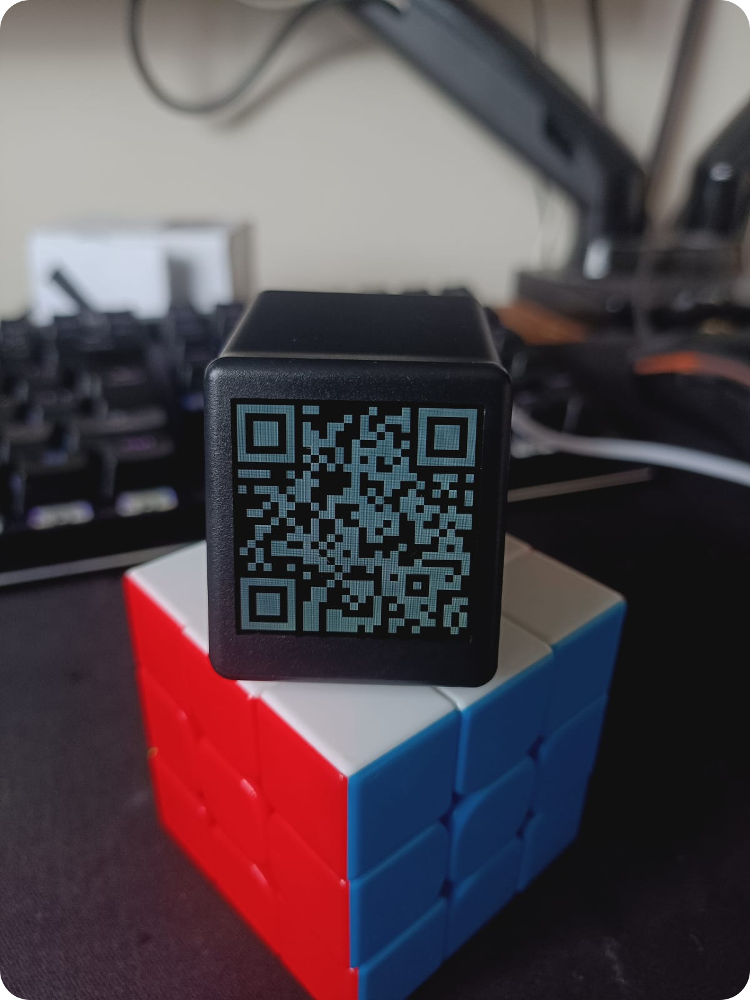
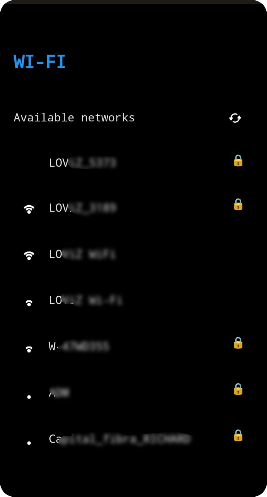

<div align="center">
    
</div>

# Geek Magic Firmware

Projeto pensado para a criação de um novo firmware customizado para uma cópia chinesa do geek magic que utiliza um esp8266 e um ch340c (conversor UART para USB) já integrado ao sistema, permitindo a gravação direta de firmware, sem nescessidade de um conversor externo.

## ✨ Funcionalidades: 

- **Relógio**: O firmware utiliza um servidor NTP público para sincronizar o horário atual;
- **Qr code para configuração do wifi**: Na primeira configuração, ou após uma tentativa falha de se auto conectar com redes conhecidas, o sistema utiliza um qr code para permitir ao usuário a conexão com o ponto de acesso, também é utilizado um módulo de dns para directionar o usuário para o portal de configuração automaticamente, facilitando o pareamento;
- **Dashboard de gerênciamento de preferências**: O sistema mantém um servidor local rodando na rede interna, permitindo acesso ao usuário, para configuração de preferências via web;
**Menu**: A aplicação possui um menu, possibilitando multiplos usos e configuração sem utilização do portal web;
**Entrada de comandos de usuário**: É realizada uma modificação no hardware, para adição de um botão de pressão, possibilitando a interface para o usuário, onde o usuário pode utilizar de comandos como "clique", "segurar" e "duplo clique".

## 🛠 Tecnologias Utilizadas

- **C++**
- **Framework Arduino** 
- **Platform.io**

## ⚙️ Instalação local
### Pré-requisitos
Certifique-se de ter os seguintes itens instalados em sua máquina para buildar o programa:

- Visual Studio Code
- PlatformIO IDE (extensão para VSCode)
- Drivers CH340/CH341 (para comunicação USB)
- Git (Windows | Linux/macOS)
- Python 3.10+ (para scripts auxiliares)
- Navegador moderno (Chrome, Firefox, Edge)
> Tutorial pensado com comandos para bash, zsh, fish ou posh, adaptações podem ser nescessárias dependendo do sistema operacional.

1. Instale a extensão PlatformIO IDE no VSCode

2. Instale os drivers do CH340C

    > Baixe o driver oficial: [CH341SER.ZIP](https://www.wch.cn/download/file?id=5) - [Site oficial](https://www.wch.cn/downloads/CH341SER_ZIP.html)\
    > Extraia e execute o instalador conforme seu sistema operacional

3. Clone o projeto: 
```bash
git@github.com:eduardo-moro/fake-geek-magic-os.git
cd fake-geek-magic-os
```

4. Configuração do Projeto no PlatformIO:
    1. Abra a pasta do projeto no VSCode
    2. Aguarde a instalação automática das dependências (libs do PlatformIO)
    3. Verifique a porta no arquivo platformio.ini:
    4. copie o arquivo `src/config/User_Setup.h` para `.pio/libdeps/TFT_eSPI/User_Setup.h` (subscreva)

5. Conecte o dispositivo via usb, confira a porta utilizada:
```bash
pio device list
```

6. Compile o projeto e faça o upload:
```bash
pio run --target upload
```
7. Você pode monitorar a porta serial com o comando:
```bash
pio device monitor
```

## 🪛 Modificação do hardware:
1. Abra o dispositivo removendo os dois parafusos da parte de baixo e empurrando gentilmente a tela.
2. Faça um jump entre os seguintes pinos:
<div align="center">
    
</div>
3. Cole um botão na parte de trás (é nescessário remover 3 linhas da abertura, pode ser feito com um alicate.
<div align="center">
    
</div>
4. Raspe uma pequena região do gnd da parte de cima da placa e ligue ao botão, o outro pino é soldado no pino que ligamos no passo 2.
<div align="center">
    
</div>
5. feche o cubo.
<div align="center">
    
</div>


## 📷 Imagens do projeto:

| **menu relógio** | **Menu Configurações** | **Menu WIFI** |
|-----------|-----------|-----------|
  |||

| **qr code** | **Menu Web** | **Video demonstração** |
|-----------|-----------|-----------|
  |||<video width="300" src="https://github.com/user-attachments/assets/e00cd91f-05d6-4324-9cac-71ca207750e2">)|


<div align="right">
    <span>Feito com ❤️</span>
</div>
